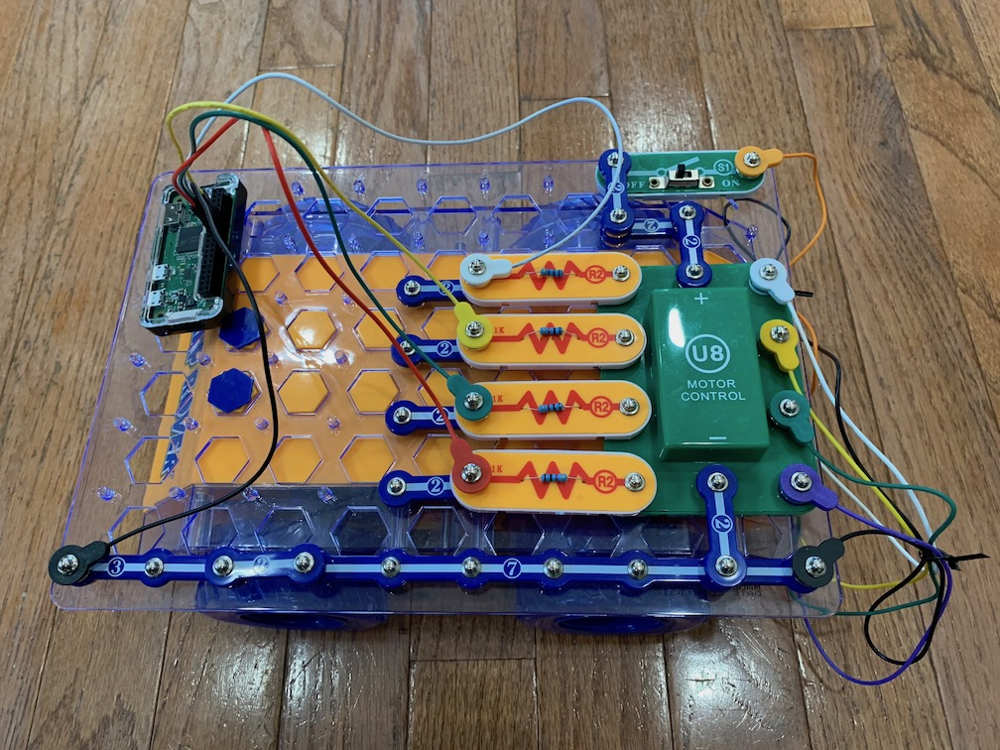
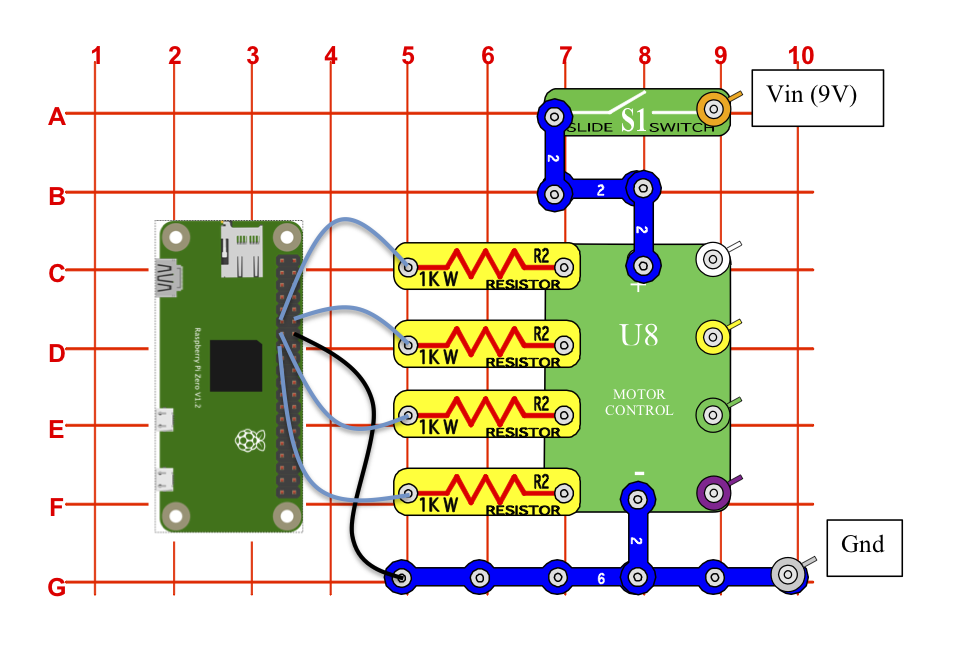

# pi-rover
This project provides a web interface to control a Snap Circuits® RC Snap Rover®, implemented with Node.js on a Raspberry Pi Zero W.



## Hardware:
* Snap Circuits® [RC Snap Rover®](https://shop.elenco.com/consumers/rc-snap-rover.html)
  * **Note:** the 'Deluxe' Snap Rover does not use the same parts and will not work with this guide
* [Snap-to-Pin connectors](https://www.amazon.com/Snap-Circuits-Project-Connectors-Expand/dp/B013DA8XH0)
* [Raspberry Pi Zero W](https://www.raspberrypi.org/products/raspberry-pi-zero-w/?resellerType=home) or other device with 
programmable GPIOs capable of running NodeJS
* [GPIO Hammer Headers](https://www.adafruit.com/product/3413) (female)
* MicroSD card
* USB battery to power the Pi

## Software:
* [Raspberry Pi OS Lite](https://www.raspberrypi.org/software/operating-systems/)
* NodeJS (tested with the unofficial [14.15.1 armv6 build](https://unofficial-builds.nodejs.org/download/release/v14.15.1/node-v14.15.1-linux-armv6l.tar.gz) on a Pi Zero W)
* The [pi-rover](https://github.com/smagoun/pi-rover/) software

## Hardware Selection
To control the rover from the internet I needed a browser-friendly technology for sending messages from the client to the server. WebSockets fit the
bill nicely. While there are ways to run a WebSocket server on a microcontroller such as an Arduino, I wanted a faster development cycle than the
Arduino offers; in particular I wanted to be able to log into the rover remotely to make changes to the server software. This implied a device
running an OS with a shell. The Raspberry Pi Zero W is a perfect fit. It's small, has Wi-Fi, runs a full Linux installation, and has plenty of CPU
power to run a small web server. Plus it's only $10, which is less expensive than virtually all other hobbyist options.

## Understanding the Snap Rover
The Snap Rover comes with a radio receiver integrated circuit (labeled RX1) and a motor control integrated circuit (labeled U8).

Step one was to see if the rover circuitry and Pi were electrically compatible. The rover uses (6) 1.5V AA batteries,
and a quick test with the multimeter confirmed that V+ on the rover body puts out 9V. Rather than use a step-down converter to safely
power the Pi from the Snap Rover's 9V, I chose to power the Pi off a USB battery.

Next I had to understand the circuitry inside the rover and its ICs to figure out how to control it from the Pi. There are 2 main
components in the Snap Rover: the Radio Receiver IC and the Motor Control IC.

**Note:** the 'Deluxe' version of the rover has a combined receiver/motor control IC (labeled RX2), which will not work with this 
guide since there is no way to bypass the radio receiver. You'll need to get a standalone motor control IC from the 
[Elenco Shop](https://shop.elenco.com/consumers/motor-control-ic.html), eBay, etc.


### Radio Receiver IC
Elenco helpfully supplies the [schematics for their integrated circuits](https://www.elenco.com/wp-content/uploads/2017/10/ic_info.pdf).
These show that the first component in the radio receiver IC is a [7805](https://www.sparkfun.com/datasheets/Components/LM7805.pdf), which
is a 5V voltage regulator. Good - the receiver runs at 5V, and almost certainly doesn't put out more than 5V on its outputs. This means that
the motor controller doesn't need more than 5V on its inputs, and there's a chance we can drive the inputs from the Pi's 3.3V GPIOs. 

The radio receiver chip is the [W55RFS27R3C](https://www.alldatasheet.com/datasheet-pdf/pdf/228390/WINBOND/W55RFS27R3C.html), which operates at 2.5-5V,
and the data sheet suggests that the digital outputs are driven at 0.7 * Vin: about 3.5V for our case. A quick test with multimeter showed 
that the receiver IC in fact drives its outputs at 1.3mA @ 1.9v. The Pi's digital outputs are a bit higher (3.3V, up to 16mA); we'll have to check on this. 
More on this in a minute.

The receiver IC has 4 motor control outputs: left forward, left backward, right forward, right backward (plus another pair of outputs, which
we'll ignore). The outputs are designed to drive a pair of motors, left and right. To go forward, drive both motors in the forward direction.
To turn, drive the motors in opposite directions. I don't have a scope to test whether these outputs have any sort of pulse width modulation (PWM)
to control the motors. Some testing with the remote control suggested the motors are a simple on/off affair with no speed control.

### Motor Control IC
The [schematic](https://www.elenco.com/wp-content/uploads/2017/10/ic_info.pdf) for the motor control circuit looks to my untrained eye like a
pair of [H-bridges](https://en.wikipedia.org/wiki/H-bridge), one for each motor. The H-bridge is a way to drive a DC motor in either direction,
which is what we're doing here. Some quick tests with the multimeter confirmed that the IC outputs 9V to the motors as expected. Per the Elenco
[schematic](https://www.elenco.com/wp-content/uploads/2017/10/ic_info.pdf) the transistors on the inputs to the H-bridge are rated at 5V input
(base/gate), so they'll tolerate the 3.3V control logic from our Pi.

This is great! Armed with the above we know that we can replace the radio receiver with a Pi, and use the GPIOs on the Pi to drive the Motor
Control IC.


## Circuit

The circuit is a simple one that replaces the radio receiver IC with the Pi:
1. The [rover manual](https://www.elenco.com/wp-content/uploads/2011/03/SCROV-10_REV-F.pdf) includes a number of circuits. Start with #1 (the 
"Night Rover") and rip out everything to the left of column 6. This leaves in place the motor control IC, the (4) 1kΩ resistors
on the inputs to the motor control IC, and the slide switch.
1. Install the female hammer headers on the Pi.
1. Use the Snap-to-Pin connectors to connect 4 of the Raspberry Pi's GPIOs to the resistors on the inputs of the motor control IC. I arbitrarily
chose pins 11/12/13/15, which correspond to GPIOs 17/18/27/22.
1. Use one more Snap-to-Pin connector to connect a ground pin from the Pi to the ground on the rover. Though we have 2 separate power supplies
(the rover at 9V and the Pi at 5V), the two sides are electrically connected and we need a common ground for the circuit to work.



**Warning:** I'm not an EE and don't know enough about circuit design to know whether the motor controller IC or rover offers sufficient protection 
against voltage spikes from the motor. I didn't see any flyback diodes in the IC schematic, the example circuits in the rover's manual, or when
I took apart the rover for a quick look inside at the wiring for the motors. I decided that the rover's components as designed were *probably* 
sufficiently protected against voltage spikes / back-emf, and therefore the Raspberry Pi was *probably* going to be OK. This is a bit of a risk,
and I don't take responsibility for broken Pis.

## Software
NodeJS has been on my list of technologies to learn, and fit the bill for this project. The node ecosystem has packages for both running WebSockets
and controlling GPIOs on a Raspberry Pi. It was straightforward to serve up a web page with buttons to control the Pi.

### OS
I used the [Raspberry Pi Imager](https://www.raspberrypi.org/blog/raspberry-pi-imager-imaging-utility/) to install Raspberry Pi OS Lite. The 
Lite version doesn't include a desktop environment, which is fine since we're running completely headless. Be sure to set up Wi-Fi and enable SSH
before booting from the image. On my mac, this entailed:

```
touch /Volumes/boot/ssh
cat >> /Volumes/boot/wpa_supplicant.conf << EOF
ctrl_interface=DIR=/var/run/wpa_supplicant GROUP=netdev
update_config=1
country=US

network={
 ssid="<network name>"
 psk="<password>"
}
EOF
```

The Pi should boot and join Wi-Fi, and can be accessed via ssh: `ssh pi@<Pi's IP address>`. 


### NodeJS
Raspberry Pi OS ships with an older version of NodeJS (10.x) that is - for whatever reason - unusably slow. I chose instead to use a more
modern version. There are no more official builds of NodeJS for the Pi Zero's aging armv6 architecture, but an unofficial build worked fine. 
Installation was straightforward:
```
wget https://unofficial-builds.nodejs.org/download/release/v14.15.1/node-v14.15.1-linux-armv6l.tar.gz
tar xf node-v14.15.1-linux-armv6l.tar.gz
export PATH=/home/pi/node-v14.15.1-linux-armv6l/bin/:$PATH
node -v
```

npm is still quite slow, but node proved to be fast enough to run the server software.

### Rover Software
The rover software uses a simple HTTP+WebSocket server to provide a web interface for controlling the rover. Clients open a WebSocket to the
server and request control of the rover. The server maintains a queue of clients that have requested control, and allows one client at a time 
to have control. The server sends a 'begin' message to the client, at which point it will accept driving commands from the client.

To install:
1. Checkout the pi-rover code: `git clone https://github.com/smagoun/pi-rover.git`
1. Change to the `pi-rover` directory and install dependencies: `npm install`
1. Run the server software: `node index.js`

Optionally set the ORIGIN environment variable to restrict the origins from which it will accept WebSocket connections:
`ORIGIN=http://external.hostname.com:80,http://internal.hostname.local:8080 node index.js`. This is useful for running the server
behind a firewall or NAT.

In a quirk that was equal parts amusing and irritating, my USB battery shuts off when there is low power draw from the USB ports.
The Pi Zero at idle doesn't draw much power, and the battery bank shuts it off. I have to keep the CPU busy in order to keep it powered on:
`nice 15 cat /dev/zero > /dev/null &`.

### Testing
To run Jest tests: `npm run test`

## Controlling the Rover
1. Launch the server
1. Turn on the rover
1. In a browser, navigate to the landing page, e.g. [http://192.168.1.123:8080/](http://192.168.1.123:8080/). 'Request control', and drive!

## License
This project is licensed under the MIT License. See [LICENSE](LICENSE) for details.
